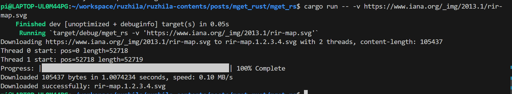

# A multi threaded downloader, written in rust

This is a simple multi-threaded download manager written in Rust.



By [ruzhila.cn](http://ruzhila.cn/?from=github_mget_rust).

### 🚀 [100-line-code](https://github.com/ruzhila/100-line-code)  A collection of learning projects written in 100 lines of code

## Features

- Multi-threaded download manager.
- No need for tokio.
- Learn command line arguments, mpsc, file operations, etc.

## Usage

```bash
Usage: mget_rs [OPTIONS] <URL>

Arguments:
  <URL>  

Options:
  -t, --threads <THREADS>  [default: 2]
  -o, --output <OUTPUT>    
  -v, --verbose            
  -h, --help               Print help
  -V, --version            Print version
```
